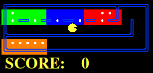

La heuristica elegida para ejercicio 7 consiste en dividir el tablero en cuadriculas no superponibles(en el codigo son 16 cuadriculas). En esta division posiblemente halla cuadriculas que no tengan pastillas y otras que si. A la hora de calcular la heuristica, se calcula el largo del minimo camino que visita todas las cuadriculas que tienen pastillas.

Esta heuristica surgio de la idea de generalizar el problema de visitar las 4 esquinas del tablero al problema de comer todas las pastillas. En este caso cada cuadricula representa una "esquina" a visitar, solo que las cuadriculas ocupan mas espacio.

Por ejemplo para el layout trickySearch, el laberinto se divide en 16 cuadriculas.

Si se eliminan las cuadriculas sin pastillas y se restringe el tamaño de manera
que haya esquinas ocupadas por pastillas entonces solo quedan 4 cuadriculas.

El minimo camino que visita todas las cuadriculas consta de 17 pasos, mientras
que el costo real de comer todas las pastillas es de 60 pasos. Usando esta 
heuristica el agente encuentra la solución en aproximadamente 2.2 segundos
explorando 9086 nodos.

La heuristica es consistente poruqe un recorrido que tiene que comer todas las
pastillas como minimo tiene que visitar todas las cuadriculas(y siempre donde
hay una cuadricula hay por lo menos 1 pastilla).